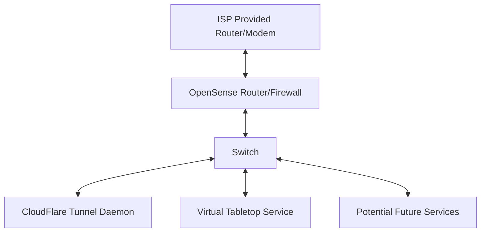
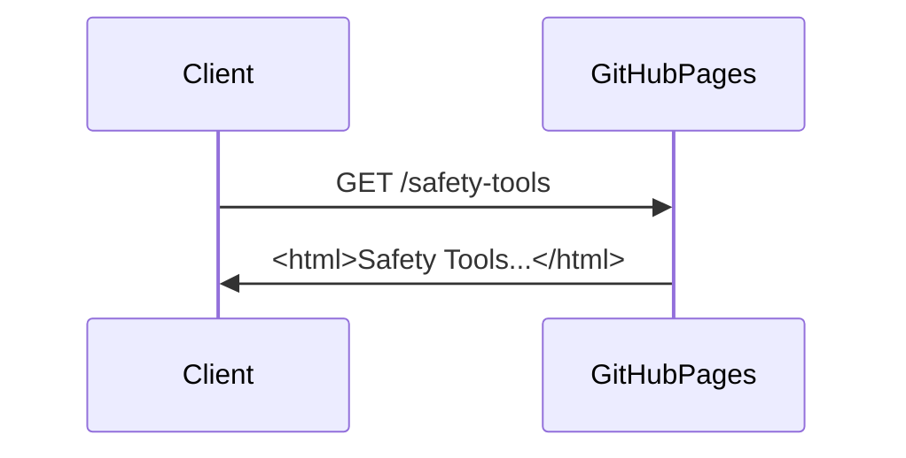
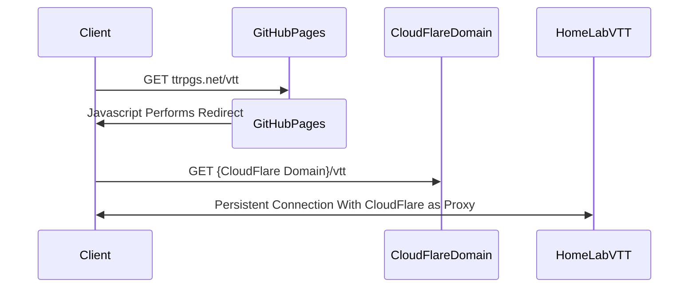

# Homelab Setup

This repo will hold everything related to my homelab, from documentation to configuration.

## Mission Statement

I hope to accomplish the following with my homelab:

- Securely host TTRPG resources such as a VTT software.
- Provide an efficient user experience for about a dozen users located around the world.
- Learn advanced nertworking concepts through hands-on experience.
- Get more practice writing Go.
- Minimize costs by building homelab components out of E-waste where possible.
- Experiment with project management tools.

## Architecture

### Authentication Needed

This above architecture does not allow an obvious method of user authentication. Without this authentication any actor could access services in my homelab. This prevents significant security and usability risks. I am exploring a number of potential solutions.

#### CloudFlare Access

CloudFlare supports multiple types of authentication for up to 50 users on the free plan.

#### Opensense Router Login

OPNsense may have tools availble to support basic auth or other forms of authentication. More research is needed...

#### Devoted NGINX server with Basic Auth

This would require setting up another device in my homelab.

## User Experiences

### Accessing Read Only Content

### Accessing VTT Software

## Glossary

This project relies on an understanding of tabletop gaming and networking concepts, and the audience for this document may be familiar with only one of those subjects. This section will define terms related to both subjects.

| Term                               | Definition                                                            |
|------------------------------------|-----------------------------------------------------------------------|
| Tabletop Role-Playing Game (TTRPG) | Think Dungeons and Dragons                                            |
| Virtual Table Top (VTT)            | Software meant to emulate the experience of playing a game on a table |

