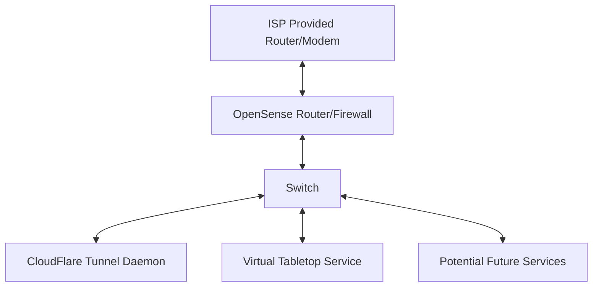
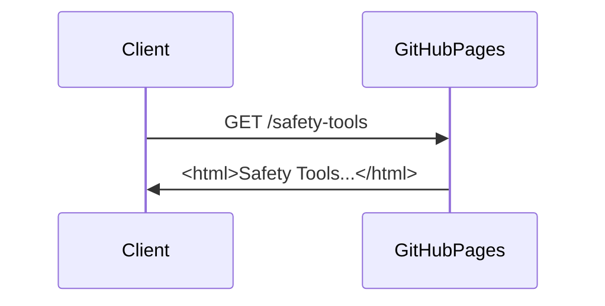
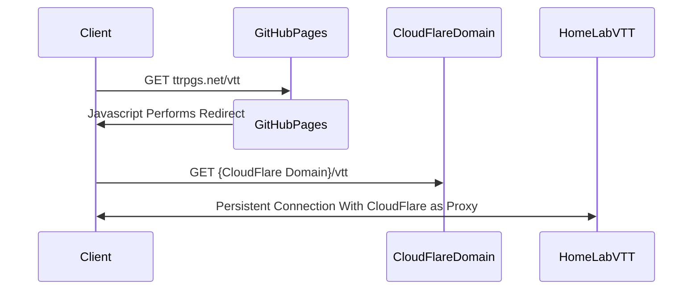

# Architecture

```mermaid
flowchart TD
    Modem[ISP Provided Router/Modem]
    Router[OpenSense Router/Firewall]
    Switch[Switch]
    CloudFlareTunnel[CloudFlare Tunnel Daemon]
    VTT[Virtual Tabletop Service]
    Service2[Potential Future Services]

    Modem <--> Router
    Router <--> Switch
    Switch <--> CloudFlareTunnel
    Switch <--> VTT
    Switch <--> Service2
```

## User Experiences

### Accessing Read Only Content

```mermaid
sequenceDiagram
    participant Client
    participant GitHubPages

    Client ->> GitHubPages: GET /safety-tools
    GitHubPages ->> Client: <html>Safety Tools...</html>
```

### Accessing VTT Software

```mermaid
sequenceDiagram
    participant Client
    participant GitHubPages
    participant CloudFlareDomain
    participant HomeLabVTT

    Client ->> GitHubPages: GET ttrpgs.net/vtt
    destroy GitHubPages
    GitHubPages ->> Client: Javascript Performs Redirect
    Client ->> CloudFlareDomain: GET {CloudFlare Domain}/vtt
    Client <<->> HomeLabVTT: Persistent Connection With CloudFlare as Proxy
```